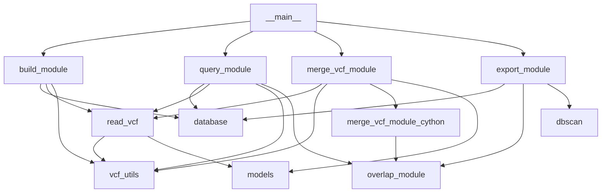
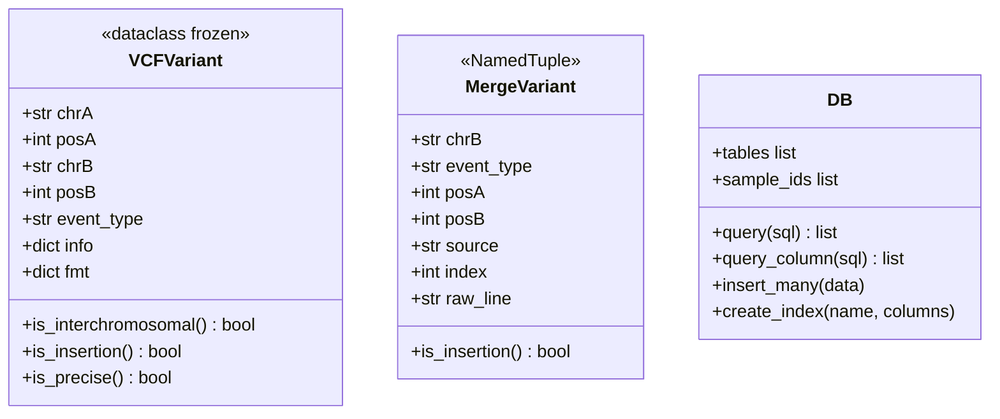

# SVDB - Package Architecture

## Module overview

| Module | Role |
|---|---|
| `__main__` | CLI entry point; argument parsing, logging setup, command dispatch |
| `build_module` | Populates a SQLite database from VCF/gzip-VCF files |
| `query_module` | Annotates a query VCF with OCC/FRQ from a VCF or SQLite database |
| `merge_vcf_module` | Merges SV calls from multiple callers/samples into one VCF |
| `merge_vcf_module_cython` | Pure-Python merge logic (optionally Cython-compiled) |
| `export_module` | Exports a SQLite database to VCF with overlap-based clustering |
| `read_vcf` | Parses a single VCF data line into a `VCFVariant` |
| `vcf_utils` | Shared I/O helpers: `open_vcf`, `normalize_chrom`, `parse_info_field`, `parse_ci` |
| `overlap_module` | Geometric overlap tests between two SV coordinates |
| `dbscan` | DBSCAN clustering used by the export module |
| `database` | Thin SQLite wrapper (`DB` class) |
| `models` | Shared data classes: `VCFVariant`, `MergeVariant` |

## Module dependencies



## Key data models



## Data flow by command

**`svdb --build`**
```
VCF files → read_vcf.readVCFLine → VCFVariant → build_module.populate_db → SQLite (.db)
```

**`svdb --query`**
```
query VCF → _read_query_vcf → variant list
DB (VCF/BEDPE/SQLite) → _load_vcf_db / SQDB
overlap_module.{precise_overlap, isSameVariation} → OCC/FRQ → annotated VCF (stdout or file)
```

**`svdb --merge`**
```
VCF files → MergeVariant list (per chrA)
merge_vcf_module_cython.merge → overlap_module.variant_overlap → merged variant dict
→ VCF to stdout
```

**`svdb --export`**
```
SQLite → fetch_variants → coordinates
→ dbscan.main or expand_chain/cluster_variants → representative variants
→ vcf_line → VCF file
```

## Packaging notes

- `pyproject.toml` - build system declaration (setuptools) and tool configuration (ruff, pytest)
- `setup.py` - retained for optional Cython compilation of `merge_vcf_module_cython` and related modules
- `requirements.txt` - runtime build deps (numpy, cython)
- `requirements-dev.txt` - development tools (pytest, pytest-cov, pytest-ruff, ruff)
