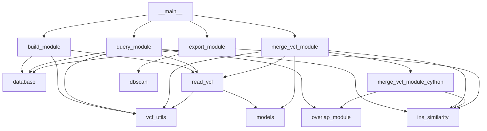
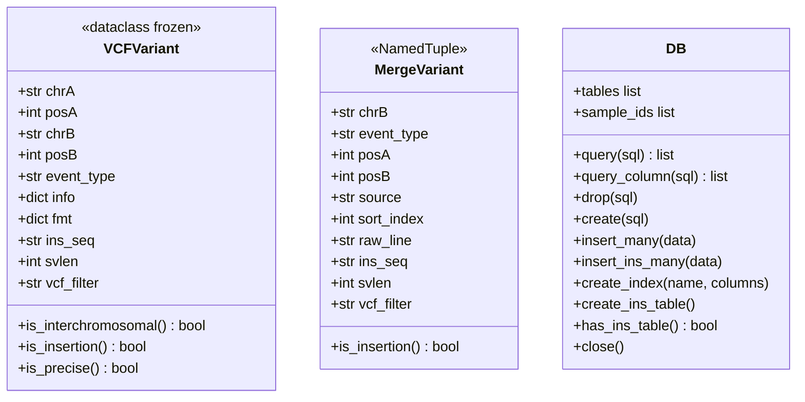
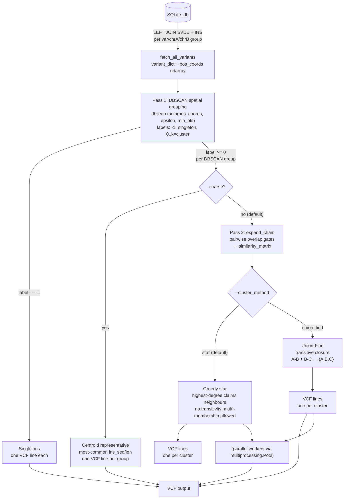

# SVDB - Package Architecture

## Module overview

| Module | Role |
| ------ | ---- |
| `__main__` | CLI entry point; argument parsing, logging setup, command dispatch |
| `build_module` | Populates a SQLite database (SVDB + INS tables) from VCF files; `--upgrade` for schema migration |
| `query_module` | Annotates a query VCF with OCC/FRQ; supports SVLEN + sequence gates for insertions |
| `merge_vcf_module` | Merges SV calls from multiple callers/samples into one VCF |
| `merge_vcf_module_cython` | Pure-Python merge logic (optionally Cython-compiled) |
| `export_module` | Exports a SQLite database to VCF; uses INS table for sequence-aware ALT column and clustering |
| `ins_similarity` | Insertion sequence gate: Levenshtein similarity, threshold resolution (`--data_profile` / `--ins_seq_similarity`) |
| `read_vcf` | Parses a single VCF data line into a `VCFVariant` |
| `vcf_utils` | Shared I/O helpers: `open_vcf`, `normalize_chrom`, `parse_info_field`, `parse_ci` |
| `overlap_module` | Geometric overlap tests between two SV coordinates |
| `dbscan` | DBSCAN clustering used by the export module |
| `database` | SQLite wrapper (`DB` class): SVDB + INS tables, context manager |
| `models` | Shared data classes: `VCFVariant`, `MergeVariant` |

## Module dependencies


```mermaid
graph TD
    main[__main__] --> build_module
    main --> query_module
    main --> merge_vcf_module
    main --> export_module

    build_module --> database
    build_module --> read_vcf
    build_module --> vcf_utils

    query_module --> database
    query_module --> read_vcf
    query_module --> vcf_utils
    query_module --> overlap_module
    query_module --> ins_similarity

    merge_vcf_module --> read_vcf
    merge_vcf_module --> vcf_utils
    merge_vcf_module --> merge_vcf_module_cython
    merge_vcf_module --> ins_similarity
    merge_vcf_module_cython --> overlap_module
    merge_vcf_module_cython --> ins_similarity

    export_module --> database
    export_module --> dbscan
    export_module --> ins_similarity

    read_vcf --> vcf_utils
    read_vcf --> models
    merge_vcf_module --> models
```

Note: `export_module` no longer imports `overlap_module`. Overlap gates are
implemented directly in `expand_chain` using numpy vectorisation (see below).

## Key data models


```mermaid
classDiagram
    class VCFVariant {
        <<dataclass frozen>>
        +str chrA
        +int posA
        +str chrB
        +int posB
        +str event_type
        +dict info
        +dict fmt
        +str ins_seq
        +int svlen
        +str vcf_filter
        +is_interchromosomal() bool
        +is_insertion() bool
        +is_precise() bool
    }

    class MergeVariant {
        <<NamedTuple>>
        +str chrB
        +str event_type
        +int posA
        +int posB
        +str source
        +int sort_index
        +str raw_line
        +str ins_seq
        +int svlen
        +str vcf_filter
        +is_insertion() bool
    }

    class DB {
        +query(sql) list
        +query_column(sql) list
        +drop(sql)
        +create(sql)
        +insert_many(data)
        +insert_ins_many(data)
        +create_index(name, columns)
        +create_ins_table()
        +has_ins_table() bool
        +close()
        +tables list
        +sample_ids list
    }
```

## Data flow by command

**`svdb --build`**

```text
VCF files → read_vcf.readVCFLine → VCFVariant
  → populate_db → SVDB table (coordinates, samples)
                → INS table   (ins_seq, ins_len per insertion idx)
  → SQLite (.db)
```

**`svdb --build --upgrade`**

```text
Existing SQLite (.db) → upgrade_db
  → CREATE INS table (if absent)
  → optional: VCF files → backfill INS rows matched by SVDB idx
```

**`svdb --query`**

```text
query VCF → _read_query_vcf → variant list
DB (VCF/BEDPE)  → _load_vcf_db → queryVCFDB
                   _parse_variants_svlens: VARIANTS field `:L{svlen}` suffix parsed
                   once at load → (min, max) SVLEN tuple per cluster entry;
                   range-based gate: min(q, max_s)/max(q, min_s) >= ins_svlen_ratio
                   ins_similarity.sequence_gate + insertion_svlen_match → OCC/FRQ
DB (SQLite)     → SQDB
                   LEFT JOIN INS (when INS table present)
                   ins_similarity.sequence_gate + insertion_svlen_match → OCC/FRQ
→ annotated VCF (stdout or file)
```

**`svdb --merge`**

```text
VCF files → MergeVariant list (per chrA)
merge_vcf_module_cython.merge
  → overlap_module.{precise_overlap, insertion_svlen_match}
  → ins_similarity.sequence_gate
  → merged variant dict → VCF to stdout
```

**`svdb --export`**


```mermaid
flowchart TD
    DB[(SQLite .db)] -->|"LEFT JOIN SVDB + INS\nper var/chrA/chrB group"| FV[fetch_all_variants\nvariant_dict + pos_coords ndarray]
    FV --> DBSCAN["Pass 1: DBSCAN spatial grouping\ndbscan.main(pos_coords, epsilon, min_pts)\nlabels: -1=singleton, 0..k=cluster"]
    DBSCAN -->|"label == -1"| SNG[Singletons\none VCF line each]
    DBSCAN -->|"label >= 0\nper DBSCAN group"| COARSE{--coarse?}
    COARSE -->|"yes"| CTR["Centroid representative\nmost-common ins_seq/len\none VCF line per group"]
    COARSE -->|"no (default)"| EC["Pass 2: expand_chain\npairwise overlap gates\n→ similarity_matrix"]
    EC --> CM{"--cluster_method"}
    CM -->|"star (default)"| STAR["Greedy star\nhighest-degree claims neighbours\nno transitivity; multi-membership allowed"]
    CM -->|"union_find"| UF["Union-Find\ntransitive closure\nA-B + B-C → {A,B,C}"]
    STAR --> OUT[VCF lines\none per cluster]
    UF --> Out2[VCF lines\none per cluster]
    SNG --> VCF[VCF output]
    CTR --> VCF
    Out2 --> VCF
    Out2 --> Par
    STAR --> Par["(parallel workers via multiprocessing.Pool)"]
    Par --> VCF
```

**Pass 1 — DBSCAN spatial grouping**: groups nearby variants by proximity.
Epsilon = `--ins_distance` for INS, `--bnd_distance` for other types.
Singletons (noise, no neighbours within epsilon) are written immediately.
See [algorithms.md](algorithms.md) for full parameter and algorithm reference.

**Pass 2 — `expand_chain` overlap gates** (cheapest-first):

| Gate | Applied to | Implementation |
| ---- | ---------- | -------------- |
| Spatial (L∞) | all types | numpy mask; cKDTree when n ≥ 200 (requires scipy) |
| Overlap ratio | DEL/DUP/INV | vectorised numpy |
| SVLEN ratio | INS | vectorised numpy (`--ins_svlen_ratio`) |
| Sequence similarity | INS | per-pair rapidfuzz Levenshtein (`--ins_seq_similarity`) |

The sequence gate is irreducibly serial; the earlier gates eliminate the vast
majority of candidates before it runs.

**Clustering** (`--cluster_method`): operates on the similarity graph output
of `expand_chain`. `star` (default): greedy, no transitivity; a variant that
overlaps multiple representatives appears in each cluster so OCC reflects all
groups it genuinely belongs to. `union_find`: transitive closure, exclusive
membership, fewer larger clusters.

**Representative row** (`_pick_representative`, both `star` and `union_find`):
degree only decides which variant *claims* a cluster's membership. The row
actually used for the exported `POS`/`SVLEN`/`ALT` is the cluster's medoid —
a real member whose own `ins_seq` already matches the cluster's consensus
sequence — falling back to the degree-based anchor when the cluster has no
single consensus (mixed/symbolic membership). This keeps the exported line
self-consistent: without it, `POS` could come from one row while `ALT` came
from a majority vote over a completely different row's sequence.

**`--coarse`**: skips Pass 2 entirely; centroid + most-common ins_seq/len from
the DBSCAN group directly. Controlled by `--epsilon`/`--min_pts`.

**ALT field per cluster**:

- `N<ins_seq>` — all members have a sequence; most-common non-null `ins_seq` used
- `<INS>` — any member lacks a sequence (capped at `--max_ins_seq_len`, symbolic allele,
            or mixed cluster); `SVLEN` taken from most-common stored length across members.
            A mixed cluster cannot be faithfully represented by one sequence.
- `<SVTYPE>` — all other types

**Parallelism**: DBSCAN groups dispatched via `multiprocessing.Pool` (spawn,
safe with numpy). Workers receive plain dicts/ndarrays; results returned in
deterministic order. Serial floor ≈ 7% of runtime on a 500-sample database.
Fallback to serial on any pool exception.

## Packaging notes

- `pyproject.toml` - build system declaration (setuptools) and tool configuration (ruff, pytest)
- `setup.py` - retained for optional Cython compilation of `merge_vcf_module_cython` and related modules
- `requirements.txt` - runtime build deps (numpy, cython)
- `requirements-dev.txt` - development tools (pytest, pytest-cov, pytest-ruff, ruff)
