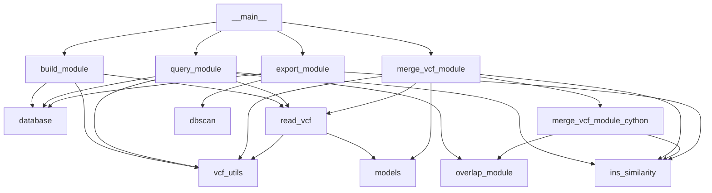
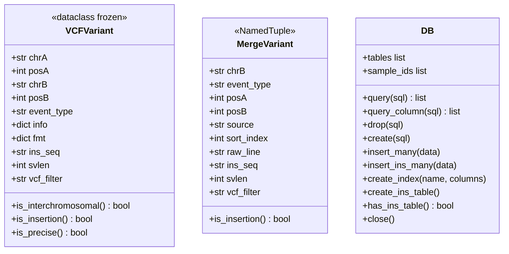

# SVDB - Package Architecture

## Module overview

| Module | Role |
| ------ | ---- |
| `__main__` | CLI entry point; argument parsing, logging setup, command dispatch |
| `build_module` | Populates a SQLite database (SVDB + INS tables) from VCF files; `--upgrade` for schema migration |
| `query_module` | Annotates a query VCF with OCC/FRQ; supports SVLEN + sequence gates for insertions |
| `merge_vcf_module` | Merges SV calls from multiple callers/samples into one VCF |
| `merge_vcf_module_cython` | Pure-Python merge logic (optionally Cython-compiled) |
| `export_module` | Exports a SQLite database to VCF; uses INS table for sequence-aware ALT column and clustering |
| `ins_similarity` | Insertion sequence gate: Levenshtein similarity, threshold resolution (`--data_profile` / `--ins_seq_similarity`) |
| `read_vcf` | Parses a single VCF data line into a `VCFVariant` |
| `vcf_utils` | Shared I/O helpers: `open_vcf`, `normalize_chrom`, `parse_info_field`, `parse_ci` |
| `overlap_module` | Geometric overlap tests between two SV coordinates |
| `dbscan` | DBSCAN clustering used by the export module |
| `database` | SQLite wrapper (`DB` class): SVDB + INS tables, context manager |
| `models` | Shared data classes: `VCFVariant`, `MergeVariant` |

## Module dependencies


```mermaid
graph TD
    main[__main__] --> build_module
    main --> query_module
    main --> merge_vcf_module
    main --> export_module

    build_module --> database
    build_module --> read_vcf
    build_module --> vcf_utils

    query_module --> database
    query_module --> read_vcf
    query_module --> vcf_utils
    query_module --> overlap_module
    query_module --> ins_similarity

    merge_vcf_module --> read_vcf
    merge_vcf_module --> vcf_utils
    merge_vcf_module --> merge_vcf_module_cython
    merge_vcf_module --> ins_similarity
    merge_vcf_module_cython --> overlap_module
    merge_vcf_module_cython --> ins_similarity

    export_module --> database
    export_module --> dbscan
    export_module --> ins_similarity

    read_vcf --> vcf_utils
    read_vcf --> models
    merge_vcf_module --> models
```

Note: `export_module` no longer imports `overlap_module`. Overlap gates are
implemented directly in `expand_chain` using numpy vectorisation (see below).

## Key data models


```mermaid
classDiagram
    class VCFVariant {
        <<dataclass frozen>>
        +str chrA
        +int posA
        +str chrB
        +int posB
        +str event_type
        +dict info
        +dict fmt
        +str ins_seq
        +int svlen
        +str vcf_filter
        +is_interchromosomal() bool
        +is_insertion() bool
        +is_precise() bool
    }

    class MergeVariant {
        <<NamedTuple>>
        +str chrB
        +str event_type
        +int posA
        +int posB
        +str source
        +int sort_index
        +str raw_line
        +str ins_seq
        +int svlen
        +str vcf_filter
        +is_insertion() bool
    }

    class DB {
        +query(sql) list
        +query_column(sql) list
        +drop(sql)
        +create(sql)
        +insert_many(data)
        +insert_ins_many(data)
        +create_index(name, columns)
        +create_ins_table()
        +has_ins_table() bool
        +close()
        +tables list
        +sample_ids list
    }
```

## Data flow by command

**`svdb --build`**

```text
VCF files → read_vcf.readVCFLine → VCFVariant
  → populate_db → SVDB table (coordinates, samples)
                → INS table   (ins_seq, ins_len per insertion idx)
  → SQLite (.db)
```

**`svdb --build --upgrade`**

```text
Existing SQLite (.db) → upgrade_db
  → CREATE INS table (if absent)
  → optional: VCF files → backfill INS rows matched by SVDB idx
```

**`svdb --query`**

```text
query VCF → _read_query_vcf → variant list
DB (VCF/BEDPE)  → _load_vcf_db → queryVCFDB
                   ins_similarity.sequence_gate + insertion_svlen_match → OCC/FRQ
DB (SQLite)     → SQDB
                   LEFT JOIN INS (when INS table present)
                   ins_similarity.sequence_gate + insertion_svlen_match → OCC/FRQ
→ annotated VCF (stdout or file)
```

**`svdb --merge`**

```text
VCF files → MergeVariant list (per chrA)
merge_vcf_module_cython.merge
  → overlap_module.{precise_overlap, insertion_svlen_match}
  → ins_similarity.sequence_gate
  → merged variant dict → VCF to stdout
```

**`svdb --export`**

```text
SQLite (.db)
  └─ fetch_all_variants (single LEFT JOIN query per var/chrA/chrB group)
       SVDB s JOIN INS i ON s.idx = i.idx
       → variant_dict {idx: {posA, posB, sample_id, ins_seq, ins_len}}
       → pos_coords ndarray (n×2)
       ins_seq: zlib-decompressed; capped to None if len > --max_ins_seq_len

  └─ dbscan.main (DBSCAN first pass, groups by spatial proximity)
       epsilon = ins_distance (INS) or bnd_distance (other types)
       → labels array: -1 = singleton, 0..k = cluster id

  └─ singletons (label == -1): written immediately, one VCF line each

  └─ per DBSCAN group → _expand_and_cluster_worker (may run in parallel)
       expand_chain (numpy-vectorised pairwise overlap, evaluated cheapest-first):
         1. spatial lookup  – L∞ mask or cKDTree (n ≥ 200, requires scipy)
         2. overlap ratio   – vectorised numpy (DEL/DUP/INV)
         3. SVLEN ratio     – vectorised numpy (INS, --ins_svlen_ratio)
         4. sequence gate   – per-pair rapidfuzz Levenshtein (INS, serial)
       → similarity_matrix {idx: ndarray of matching idx values}

       cluster_variants (--cluster_method star, default)
         greedy star: sort by degree desc; highest-degree variant claims
         its unclaimed neighbours; no transitivity
       OR
       cluster_variants_union_find (--cluster_method union_find)
         Union-Find transitive closure: A-B and B-C always merge A,B,C
         even if A and C do not overlap directly; structurally prevents
         duplicate cluster membership

       → [(rep_variant, cluster_dict), ...]
         rep: ins_seq = most-common non-null sequence across cluster members
              ins_len = most-common non-null length

  └─ _run_tasks: parallel dispatch
       workers = --workers (0 = os.cpu_count(); 1 = serial)
       multiprocessing.get_context("spawn") pool → pool.map
       fallback to serial on any pool exception (MemoryError, OS limits, …)
       results returned in submission order (deterministic)

  └─ vcf_line per cluster
       ALT: N+ins_seq  if ins_seq present
            <INS>       if ins_len present but no sequence (capped or absent)
            <SVTYPE>    for all other types
       INFO: SVTYPE, END, SVLEN, NSAMPLES, OCC, FRQ, CIPOS, CIEND, VARIANTS
       --samples off: omit FORMAT and GT columns (sites-only, analogous to
                      gnomAD --sites-only); OCC/FRQ still written
       --strip_chr: normalise chromosome names (chr1 → 1)

  → VCF file (header written before export loop; clusters appended)
```

## Export clustering algorithms

Two algorithms are available via `--cluster_method`:

### Greedy star (default: `--cluster_method star`)

Operates on the overlap graph produced by `expand_chain`:

1. Sort variants by degree (number of overlapping neighbours) descending.
2. The highest-degree unclaimed variant becomes a cluster representative.
3. The representative claims all its unclaimed neighbours.
4. Repeat until all variants are claimed.

**Properties**: fast; no transitivity (A-B and B-C do not force A and C
together unless A-C also overlap); one VCF line per representative.

**When to use**: conservative merging; when you want the representative to
directly overlap every cluster member.

### Union-Find (`--cluster_method union_find`)

Builds the full transitive closure of the overlap graph using a
path-compressed, union-by-rank disjoint-set structure:

1. For every overlapping pair (i, j) in `similarity_matrix`, call union(i, j).
2. Collect connected components; representative = highest-degree member.

**Properties**: structurally prevents duplicate cluster membership; merges
chains (A-B, B-C → {A,B,C}) that greedy star would split; produces fewer,
larger clusters with higher OCC counts.

**When to use**: maximal merging across a cohort; population-level databases
where transitive relationships are expected.

### expand_chain performance

`expand_chain` computes the pairwise overlap matrix within each DBSCAN group.
Overlap gates are evaluated cheapest-first to minimise work:

| Gate                | Applied to  | Implementation                                          |
| ------------------- | ----------- | ------------------------------------------------------- |
| Spatial (L∞)        | all types   | numpy mask; cKDTree when n ≥ 200 (requires scipy)       |
| Overlap ratio       | DEL/DUP/INV | vectorised numpy                                        |
| SVLEN ratio         | INS         | vectorised numpy (`--ins_svlen_ratio`)                  |
| Sequence similarity | INS         | per-pair rapidfuzz Levenshtein (`--ins_seq_similarity`) |

The sequence gate is irreducibly serial (per-pair string comparison); the
three earlier gates eliminate the vast majority of candidates before it runs.

### Parallelism

DBSCAN groups within each `(variant, chrA, chrB)` batch are dispatched to a
`multiprocessing.Pool` (spawn context, safe with numpy on all platforms).
Workers receive only plain dicts and ndarrays — no file handles, no DB
connections — and return `(rep, cluster_dict)` pairs. The main thread writes
results in order.

The serial floor (DB fetch, DBSCAN, singleton writes, file I/O) is
approximately 7% of total runtime for a 500-sample database, setting a
theoretical minimum of ~7× speedup regardless of worker count. Observed
speedup on a 32-core server: 6–7× with 10–24 workers.

A fallback to serial execution is triggered automatically if pool creation or
`pool.map` raises any exception (including `MemoryError`).

## Packaging notes

- `pyproject.toml` - build system declaration (setuptools) and tool configuration (ruff, pytest)
- `setup.py` - retained for optional Cython compilation of `merge_vcf_module_cython` and related modules
- `requirements.txt` - runtime build deps (numpy, cython)
- `requirements-dev.txt` - development tools (pytest, pytest-cov, pytest-ruff, ruff)
